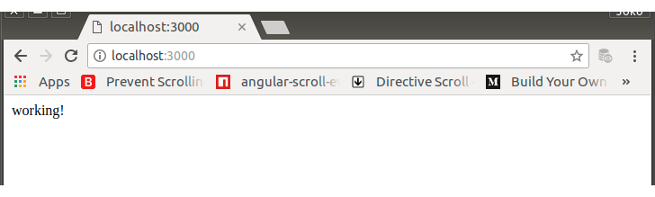

# PREPARATION

Sebagai sebuah aplikasi yang dirancang dengan prinsip separation of concern, RightCarbo berada di client alias sebagai frontend. Di belakang (banckend), RightCarbo harus dilayani oleh sebuah sebuah REST Server. REST Server akan menyediakan kebutuhan apapun yang terkait dengan data. Data terstruktur yang berasal dati mesin database maupun penggalan-penggalan data tertentu dengan  mudah, cepat, tepat, dan aman. REST Server dapat diakses oleh RightCarbo yang akan disajikan untuk user dan RightCarbo yang khusus digunakan oleh Administrator.

## IMPLEMENTATION 0

Sebelum pengembangan dilakukan, akan dilakukan persiapan lingkungan server dengan inisiasi dan instalasi expressJS.

0.	Buat direktori dengan posisi sejajar dengan rightcarbo/. Application server untuk user.

	$ mkdir rightcarbo-rest

1.	Hop ke direktori baru tersebut dan lakukan inisiasi server dengan git dan npm. 
	Jawab semua pertanyaan dengan enter (alias menggunakan jawaban default).

        $ cd rightcarbo-rest
        $ git init
        $ npm init

        This utility will walk you through creating a package.json file.
        It only covers the most common items, and tries to guess sensible defaults.

        See `npm help json` for definitive documentation on these fields
        and exactly what they do.

        Use `npm install <pkg>` afterwards to install a package and
        save it as a dependency in the package.json file.

        Press ^C at any time to quit.
        package name: (rightcarbo-rest) 
        version: (1.0.0) 
        description: REST Server for RightCarbo
        entry point: (index.js) 
        test command: 
        git repository: 
        keywords: 
        author: Joko Wandyatmono
        license: (ISC) 
        About to write to /home/wandyatmono/projects/bandung/rightcarbo-rest/package.json:

        {
        "name": "rightcarbo-rest",
        "version": "1.0.0",
        "description": "REST Server for RightCarbo",
        "main": "index.js",
        "scripts": {
            "test": "echo \"Error: no test specified\" && exit 1"
        },
        "author": "Joko Wandyatmono",
        "license": "ISC"
        }


        Is this ok? (yes) 

    Perhatikan informasi mengenai package.json yang terbentuk

2.  Install expressJS

	    $ npm install express --save

        npm notice created a lockfile as package-lock.json. You should commit this file.
        npm WARN rightcarbo-rest@1.0.0 No description
        npm WARN rightcarbo-rest@1.0.0 No repository field.

        + express@4.16.3
        added 50 packages in 11.897s

    Selain telah tercipta direktori node_modules dengan segala isinya, package.json ter-update dengan isinya menjadi sebagai berikut:

        ```json
        {
            "name": "rightcarbo-rest",
            "version": "1.0.0",
            "description": "REST Server for RightCarbo",
            "main": "index.js",
            "scripts": {
                "test": "echo \"Error: no test specified\" && exit 1"
            },
            "author": "Joko Wandyatmono",
            "license": "ISC",
            "dependencies": {
                "express": "^4.16.3"
            }
        }
        ```

    Perhatikan versi expressJS yang diinstall oleh npm di dependencies property.

## IMPLEMENTATION 1

Membuat Dumb Server

0.  Untuk memeriksa bahwa lingkungan benar-benar telah siap, buat sebuah server index.js, seperti telah disebut di package.json

	    $	touch index.js

1.  Script,

    index.js

        ```javascript
        /*
		Akses expressJS di-assign ke variable express
		Membuat instant aplikasi berbasis express bernama app
		*/
		var express = require("express");
		var app = express();

		/*
		Routing untuk root. Jika request url hanya '/' alias root, response untuk browser adalah sebuah string 'working!'.
		*/
		app.get('/', function(req,res) {
			res.send('working!');
		});

		/*
		Aplikasi app berjalan dengan port 3000 dan setelah port diinisiasi, ke system console dikirim sebuah string, "REST Server running on port 3000"
		*/
		app.listen(3000, function() {
			console.log('REST Server running on port 3000');
		});
        ```

2.	Jika aplikasi dijalankan dan tidak diketemukan adanya error, berarti
	expressJS sudah berjalan dengan baik dan aplikasi siap dikembangkan agar bisa menerima request dari browser.

        $ node index.js
        REST Server running on port 3000

	Dengan browser, masukkan url http://localhost:3000/
	Jika REST Server jalan, hasilnya akan terlihat seperti berikut ini

    <br>
    <center><i>Gambar 0000-0: REST first running on console</i></center>

3.  Commit

        $ git add .
        $ git commit -m "Check working environment and dumb-server"

4.  Selesai
