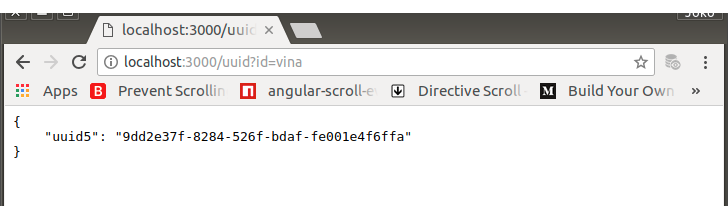

# UUID GENERATOR

Ada berbagai kepentingan di RightCarbo yang sangat bergantung dari pembangkitan UUID (versi 5). Sehingga menjadi relevant jika sementara dalam pengembangan, RESTAPI menyediakan route-method untuk pembangkitan UUID5. 

Dapat digunakan untuk melayani permintaan uuid5 langsung lewat url maupun lewat client-script di dalam aplikasi. 

## IMPLEMENTATION

Plugin untuk membangkitkan UUID5

0.  Menambahkan plugin

	Tambahkan dulu module bernama uuid5, module yang akan menerbitkan uuid. A UUID (Universal Unique Identifier) is a 128-bit number used to uniquely identify some object or entity on the Internet. Depending on the specific mechanisms used, a UUID is either guaranteed to be different or is, at least, extremely likely to be different from any other UUID generated until 3400 A.D. 

        $ npm install uuid5 --save

        npm WARN rightcarbo-rest@1.0.0 No description
        npm WARN rightcarbo-rest@1.0.0 No repository field.
        npm WARN optional SKIPPING OPTIONAL DEPENDENCY: fsevents@1.2.2 (node_modules/fsevents):
        npm WARN notsup SKIPPING OPTIONAL DEPENDENCY: Unsupported platform for fsevents@1.2.2: wanted {"os":"darwin","arch":"any"} (current: {"os":"linux","arch":"x64"})

        + uuid5@1.0.2
        added 1 package in 14.241s

1.  Sunting index.js menjadi sebagai berikut:

        ```javascript
        var express = require("express");
        var bodyParser = require("body-parser");
        var uuid5 = require("uuid5");

        var app = express();                 

        app.use(bodyParser.json());
        app.use(bodyParser.urlencoded({ extended: false}));

        app.listen(3000, function() {
            console.log('REST Server running on port 3000');
        });

        app.get('/', function(req, res) {
            var result = {};
            result.message = 'RightCarbo Rest Server';
            res.setHeader("Access-Control-Allow-Origin", "*");
            res.setHeader('Content-Type', 'application/json');
            res.send(JSON.stringify(result, null, 4));
        });

        app.get('/uuid', function(req,res) {
            var result = {};
            if (req.query.id) {
                result.uuid5 = uuid5(req.query.id);
            } else {
                result.uuid5 = "no data-feed, path?id=...";
            }
            res.setHeader("Access-Control-Allow-Origin", "*");
            res.setHeader('Content-Type', 'application/json');
            res.send(JSON.stringify(result, null, 4));

        });

        app.get('/uuidhr', function(req,res) {
            var result = {};
            if (req.query.id) {
                result.uuid5 = uuid5(req.query.id+"|"+process.hrtime());
            } else {
                result.uuid5 = "no data-feed, path?id=...";
            }
            res.setHeader("Access-Control-Allow-Origin", "*");
            res.setHeader('Content-Type', 'application/json');
            res.send(JSON.stringify(result, null, 4));
        });
        ```

2.  Coba dari browser

	Perhatikan, untuk

		http://localhost:3000/uuid/?id=vina

	akan selalu menghasilkan UUID5 yang sama setiap kali di refresh.

	Tetapi, untuk 

		http://localhost:3000/uuidhr/?id=vina

	Karena ditambah dengan current-timestamp, akan selalu menghasilkan UUID5 yang berbeda setiap kali di refresh.

    <br>
    <center><i>Gambar 0002-0: REST uuid5</i></center>

    <br>
    <center><i>Gambar 0002-1: REST uuid5 with hrtime</i></center>